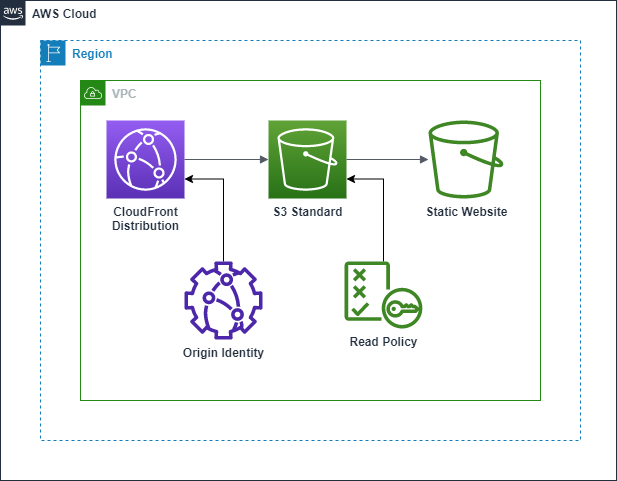

# Static Website with S3 and CloudFront

This example display how to host a static website (React, Vue.js, Angular, HTML plain) on an S3 bucket, how to protect it with TLS 1.2 and how to expose it using a custom domain name via Route 53.

## Architecture

The diagram below displays the composition of this Cloud Formation.



We have used the following components:

- A S3 Bucket with Standard Tier for hosting the web application files
- A CloudFront service to expose SSL over HTTPS, to secure the transport layer 
- An Optional Route 53 that provide the configuration for a Custom Domain name

## Execution

For the rest, execute as usual:

```bash
$ aws cloudformation deploy 
    --template-file .\cloud-formations\architectures\s3-website\s3-static.template.yaml 
    --stack-name static-s3 
    --parameter-overrides "BucketNameParameter=static-s3-bucket"
```

Then you can copy the demo file to verify that the Bucket is created correctly and hosting the file correctly

```bash
$ aws s3 cp 
.\cloud-formations\architectures\s3-website\index.html 
s3://static-s3-bucket
 ```